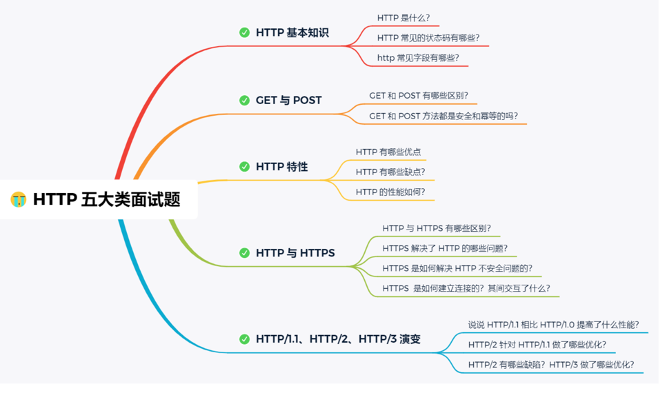
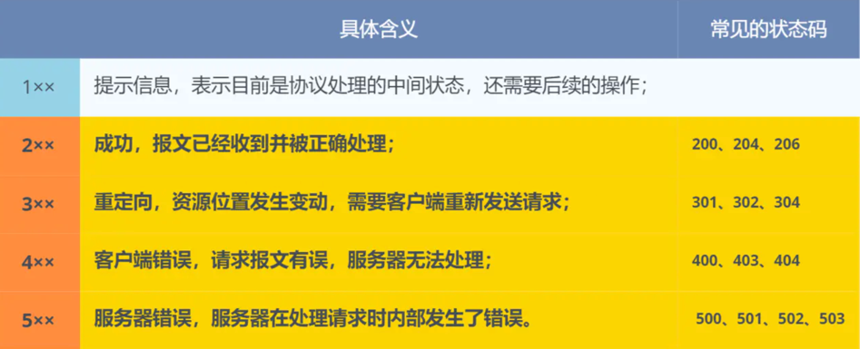
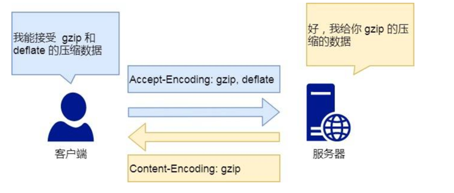
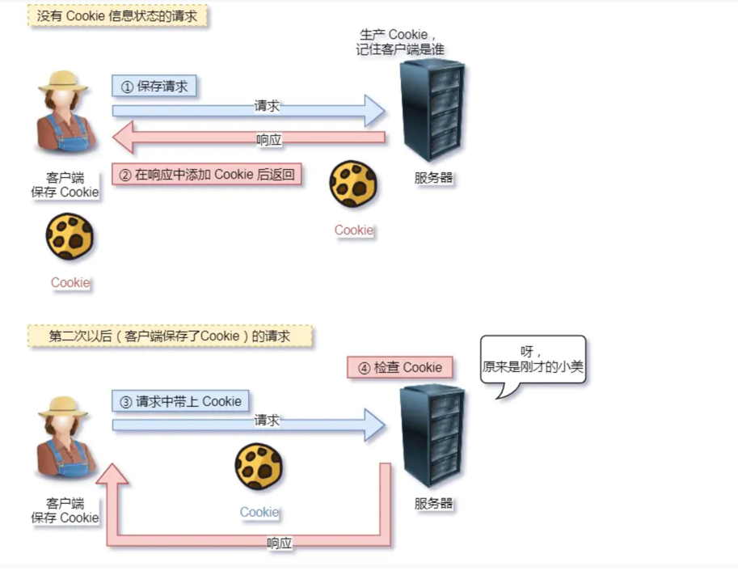
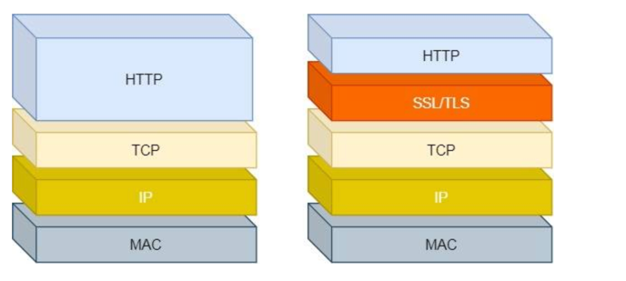
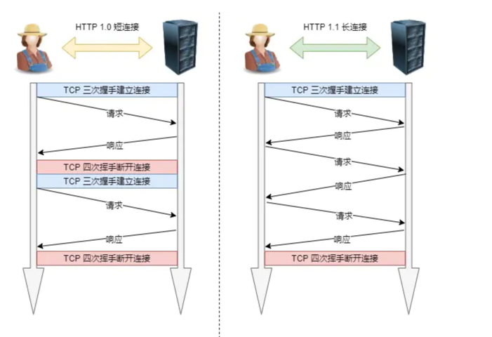
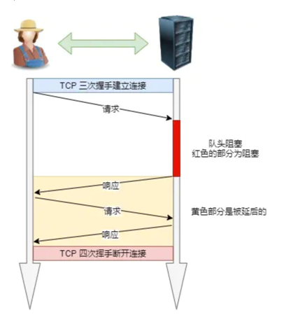

### http相关问题整理





```text

http的基本概念。

HTTP是用在计算机世界里的协议，它使用计算机能够理解的语言确立了一种计算机直接交流的规范(两个以上的参与者)
以及相关的各种控制和处理错误处理方式(行为约定和规范)。

HTTP 传输的内容是「超文本」。

我们先来理解「文本」，在互联网早期的时候只是简单的字符文字，但现在「文本」的涵义已经可以扩展为图片、视频、压缩包等，在 HTTP 眼里这些都算作「文本」。

再来理解「超文本」，它就是超越了普通文本的文本，它是文字、图片、视频等的混合体，最关键有超链接，能从一个超文本跳转到另外一个超文本。

HTML 就是最常见的超文本了，它本身只是纯文字文件，但内部用很多标签定义了图片、视频等的链接，再经过浏览器的解释，呈现给我们的就是一个文字、有画面的网页了


```

### 常见五大类http状态码




### http常见的字段有哪些？
```text

Host字段，客户端发起请求的时候，用来指定服务器的域名

Content-Length字段，服务器返回数据的时候，会有Content-Length字段，表明本次回应的数据长度

Content-Length: 1000， 则是告诉浏览器，本次服务器回应的数据长度是 1000 个字节，后面的字节就属于下一个回应了。

Connection字段，最常用于客户端要求服务器使用TCP持久连接，以便其他请求复用。HTTP/1.1 版本的默认连接都是持久连接，但为了兼容老版本的 HTTP，需要指定 Connection 首部字段的值为 Keep-Alive。

Content-Type字段， 用于服务器相应时，告诉客户端，本次的数据格式是什么

客户端请求的时候，可以使用Accept字段声明自己可以接受那些数据格式， Accept: */* 可以接受任何形式的数据。

Content-Encoding字段，说明数据压缩的方法，表示服务器返回的数据使用了什么压缩格式。

```



** 还有众多的字段，可以参考HTTP的官方doc

```text

GET 和 POST 方法都是安全和幂等的吗？
- 在HTTP协议里面，所谓【安全】是指请求方法不会破坏服务器上的资源
- 所谓【幂等】，意思是多次执行相同的操作。结果都是相同的

那么很明显 GET 方法就是安全且幂等的，因为它是「只读」操作，无论操作多少次，服务器上的数据都是安全的，且每次的结果都是相同的。
POST 因为是「新增或提交数据」的操作，会修改服务器上的资源，所以是不安全的，且多次提交数据就会创建多个资源，所以不是幂等的。

```

### HTTP特性
```text

HTTP 最突出的有点是 简单 灵活 和易于扩展，应用广泛和跨平台。

1： 简单
http基本的报文格式就是 header+body 头部信息也是 key-value的简单形式，易于理解，降低了学习和使用的门槛
2： 灵活和易于扩展
HTTP协议里的各类请求方法，URL/URI, 状态吗，头部字段等每个组成要求都没有被固定死，允许开发人员自定义和扩展。
同时HTTP由于是工作在应用层(ISO第七层) 则它下层可以随便变化。
HTTPS也就是在HTTP与TCP层之间增加了SSL/TLS安全传输层，HTTP/3甚至把TCP层换成了基于UDP的QUIC
3：应用广泛和跨平台
从台式机各种app等 各种平台 工具 信息链等等。。。

4: 缺点

HTTP 协议里有优缺点一体的双刃剑，分别是「无状态、明文传输」，同时还有一大缺点「不安全」

1: 无状态双刃剑

无状态的好处，因为服务器不会去记忆HTTP的状态，所以不需要额外的资源来记录登陆状态，能减轻服务器的压力，能够把更多的CPU和内存用来对外提供服务。
无状态的坏处，既然服务器没有记忆能力，它在完成有关联性的操作时会非常麻烦。
例如登录->添加购物车->下单->结算->支付，这系列操作都要知道用户的身份才行。但服务器不知道这些请求是有关联的，每次都要问一遍身份信息。
对于无状态的问题，解法方案有很多种，其中比较简单的方式用 Cookie 技术。
Cookie 通过在请求和响应报文中写入 Cookie 信息来控制客户端的状态。

```


```text

2. 明文传输双刃剑
明文意味着在传输过程中的信息，是可方便阅读的，通过浏览器的 F12 控制台或 Wireshark 抓包都可以直接肉眼查看，为我们调试工作带了极大的便利性。
但是这正是这样，HTTP 的所有信息都暴露在了光天化日下，相当于信息裸奔。在传输的漫长的过程中，
信息的内容都毫无隐私可言，很容易就能被窃取，如果里面有你的账号密码信息，那你号没了。

```
```text

3: 不安全
HTTP比较严重的缺点就是不安全

- 通信使用明文(不加密),内容可能被窃取
- 不验证通信方的身份，因此有可能是伪装的。
- 无法证明报文的完整性，所以有可能已经被篡改。

HTTP 的安全问题，可以用 HTTPS 的方式解决，也就是通过引入 SSL/TLS 层，使得在安全上达到了极致。

```

```text

http与https的区别

1: HTTP 是超文本传输协议，信息是明文传输，存在安全风险的问题。HTTPS 则解决 HTTP 不安全的缺陷，在 TCP 和 HTTP 网络层之间加入了 SSL/TLS 安全协议，使得报文能够加密传输。
2: HTTP 连接建立相对简单， TCP 三次握手之后便可进行 HTTP 的报文传输。而 HTTPS 在 TCP 三次握手之后，还需进行 SSL/TLS 的握手过程，才可进入加密报文传输。
3: HTTP 的端口号是 80，HTTPS 的端口号是 443。
4: HTTPS 协议需要向 CA（证书权威机构）申请数字证书，来保证服务器的身份是可信的。

```

```text

HTTPS解决了HTTP哪些问题？
1: 窃听风险，比如通信链路上可以回去通信内容,造成丢失账号
2: 篡改风险. 比如强行植入垃圾广告
3: 冒充风险, 比如丢失用户下的信息

```



```text

HTTPS 在 HTTP 与 TCP 层之间加入了 SSL/TLS 协议，可以很好的解决了上述的风险
- 信息加密：交互信息无法被窃取
- 校验机制：无法篡改通信内容，篡改了就不能正常显示
- 身份证书：证明xxx是真的xxx

只要自身不做「恶」，SSL/TLS 协议是能保证通信是安全。

```

```text

HTTPS 是如何解决上面的三个风险的？
- 混合加密的方式实现信息的机密性，解决了窃听的风险。
- 摘要算法的方式来实现完整性，它能够为数据生成独一无二的「指纹」，指纹用于校验数据的完整性，解决了篡改的风险。
- 将服务器公钥放入到数字证书中，解决了冒充的风险。

再细说之前，看看在HTTPS通信中，客户端和服务端之间的通信流程如下：

1： 客户端发送一个HTTPS请求给服务器。
2： 服务器将自己的SSL证书（包含公钥）发送给客户端。
3： 客户端收到证书后，会验证证书的合法性和服务器的身份。
4： 如果证书有效，则客户端会生成一个随机的对称密钥，使用服务器的公钥加密该对称密钥，并将其发送给服务器。
5： 服务器收到加密的对称密钥后，使用自己的私钥解密得到对称密钥。
6： 服务器和客户端都使用该对称密钥加密和解密传输的数据。

在这个过程中，SSL或TLS协议使用非对称加密和对称加密两种加密方式来保护数据的安全：

1： 非对称加密：使用服务器的公钥加密对称密钥，只有服务器的私钥可以解密，保证了对称密钥在传输过程中不被窃取或篡改。
2： 对称加密：使用对称密钥对传输的数据进行加密和解密，可以快速地加密和解密大量数据，提高传输效率

```


```text

HTTP/1.1的性能如何？
HTTP是基于TCP/IP，并使用了【请求-答应】的通信模式，所以性能的管家就在这两点

1： 长链接
其实早期的HTTP/1.0性能上的很大的问题，那就是每次发起一个请求，都要建立TCP链接(三次握手), 而且是串行请求，做了无谓的TCP链接和断开，增加了通行开销。

为了解决上述问题，HTTP/1.1提出了长链接的通行方式，也叫持久链接，这种方式的好处在于减少了TCP链接的重复建立和断开所造成的额外开销，减轻了服务器端的负载。
持久链接的特点是，只要任意一端没有明确的提出断开链接，则保持TCP的链接状态

```



```text

HTTP/1.1采用了长链接的方式，使得管道(pipeline)网络传输称为可能。
也就是说，在同一个TCP链接里面。客户端可以发起多个请求，只要第一个请求发出去，不必等其回来，就可以发第二个请求出去。可以减少整体的相应时间。
举例来说，客户端需要请求两个资源。以前的做法是，在同一个TCP连接里面，先发送 A 请求，
然后等待服务器做出回应，收到后再发出 B 请求。管道机制则是允许浏览器同时发出 A 请求和 B 请求。

```
